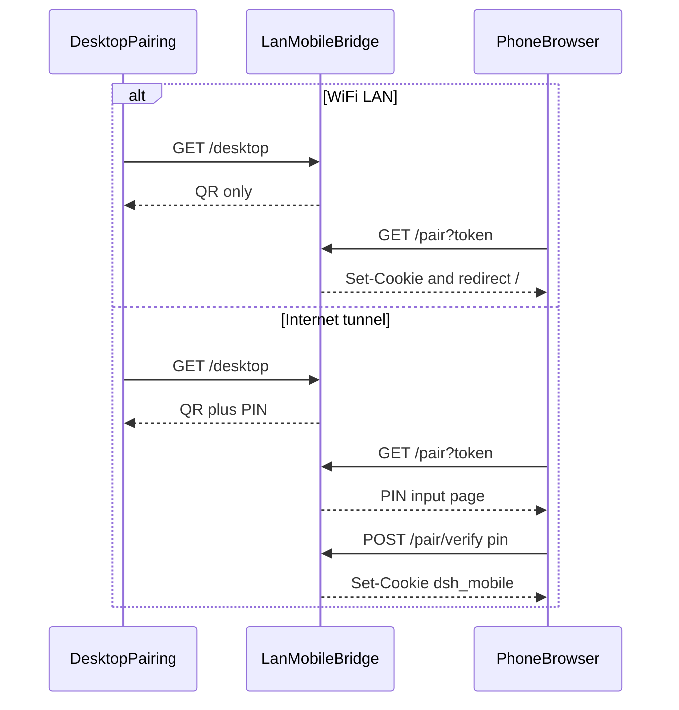
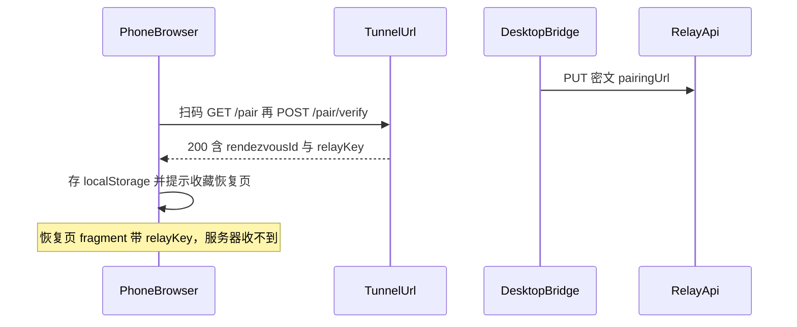

# 手机配对：按模式拆分（扫码即连 / 隧道 PIN）

> 状态：已实现（2026-09-14）。  
> 范围：把桌面「允许 / 拒绝」改成按连接模式授权；Cloudflare 保活；免费 Pinggy 过期体验做诚实。配对中转见文末附录，**不在本次实现**。  
> 相关代码：[`src/main/mobile/lan-mobile-bridge.ts`](../src/main/mobile/lan-mobile-bridge.ts)、[`src/main/mobile/lan-mobile-pages.ts`](../src/main/mobile/lan-mobile-pages.ts)、[`src/main/index.ts`](../src/main/index.ts)。

## 1. 结论摘要

WiFi 与互联网隧道的风险不同，授权分开：

- **WiFi**：短时 QR Token 即凭证，扫完直接进 App。桌面只留「已连接 / 断开」。
- **互联网隧道**：公网 URL 可泄露，额外要求桌面生成并展示的 6 位 PIN。记住后重连只需在手机输入，不必回桌面点允许。
- PIN 不写入二维码 URL，不进入 `snapshot()` / IPC。

局域网重连**不能**凭 `/reconnect` 自动放行（同 Wi-Fi 知道端口即可闯入）。断开后请用户再次扫码。

**Cloudflare** 是常态长连接路径（进程活着则域名不变）。**Pinggy** 是 Cloudflare 不可用者（如中国大陆）的一等备用，免费档约 60 分钟硬限制，本次只把过期体验做顺，**不承诺无感长连**。人不在电脑边、免费 Pinggy 换域名后的免扫恢复，只有独立中转或固定域名能解，见附录。

## 2. 隐私同意与 PIN 有效期

长效 PIN 会在本机长期保存一个可复用的连接凭证，配合公网隧道 URL 属于隐私敏感项。因此**默认不生成长效 PIN**，必须由用户在「连接手机」页显式同意后才生成。

- **默认（未同意）＝临时 PIN**：进入隧道模式时生成一个 **5 分钟有效、只存内存、不落盘**的 6 位 PIN（与现有 `pairingToken` 5 分钟 TTL 对齐）。过期或桌面重启后失效，需重新扫码并看新 PIN。相当于「每次连都要在电脑边确认」，隐私最好。
- **勾选同意后＝长效 PIN**：`ensurePairingPin()` 生成 6 位 PIN 并写入 userData，长期复用；记住后重连只需输入，不必回桌面。可随时「重置密码」或取消同意（删除落盘 PIN，回到临时模式）。
- 同意状态本身也持久化（`pinConsent` 布尔），下次开启隧道沿用；取消同意时一并清除已落盘的 PIN。
- 声明文案要说明：长效 PIN 保存在本机、可随时重置/取消、不上云、不写入二维码。

## 3. 扫码是不是一劳永逸

**不是。** PIN 持久化只省掉隧道上的「点允许 / 对一下新密码」，不替代扫码。三件事分工不同：

- **二维码**：告诉手机「这台电脑现在的地址」+ 短时 `pairingToken`。LAN 是 `http://<局域网IP>:43127/pair?token=...`；隧道是本次 Quick Tunnel 的随机域名。
- **持久 PIN**：只在隧道里证明「你被允许连」。PIN 不会变成固定入口，也不写入二维码。
- **Cookie `dsh_mobile`（`Max-Age=31536000`，约一年）**：只是浏览器里的会话凭证。服务端 session 在 Bridge 进程内存里，**退出 DSH Desktop 就清空**。Cookie 还在、服务端没有这条 session，一样是 401。

因此「扫一次长期能用」只发生在 **地址没变 + 桌面进程还活着且 session 还在 + Cookie 还在**：

- 同一手机、同一浏览器（或已加到主屏幕），桌面一直开着、没点断开 → **不用再扫**，和现在一样。
- 桌面点了断开：WiFi 必须再扫（换新 token）；隧道若 **URL 没变**（书签 / 上次页面还在），只需输入同一个 PIN，不用扫。
- 清了站点数据、换浏览器、换另一部手机 → 要重新找到地址：WiFi 再扫即连；隧道再扫然后输入原 PIN。
- 换 Wi-Fi / 电脑 IP 变了 → 旧局域网地址失效，必须再扫。
- **隧道有效期（已核对，与 Cookie 一年无关）**：
  - **Cloudflare Quick Tunnel**（`cloudflared tunnel --url` → `*.trycloudflare.com`）：官方文档**没有写死过期分钟数**，也**没有 SLA**。域名随本次 `cloudflared` 子进程存活；进程在（桌面不关、隧道不关）则同一 URL 可以一直用，进程一停或再开一次就换新随机域名。Wrangler 自己有 60 分钟客户端关隧道逻辑，**本应用没用 Wrangler，不套这条**。
  - **Pinggy 免费档**（代码连的是 `free.pinggy.io`）：[官方说明](https://pinggy.io/help/) 明确 **60 分钟 timeout**。到时或手动关掉后再开，**一定换新 URL**。
  - 两种方案都是临时隧道。Cookie 记在「当时那个域名」上；域名一换，一年 Cookie 也打不到这台电脑。

PIN 持久化的实际收益是：隧道授权稳定，重连不必回桌面点允许；**不是**做成「扫一次、以后只靠密码、永远不用二维码」。若要真正免扫，需要固定隧道域名或独立入口页，见附录，不在本次范围。

## 4. 两条隧道的定位

- **Cloudflare = 常态长连接路径**：Quick Tunnel 无 60 分钟硬超时。只要桌面和 `cloudflared` 进程活着，域名不变、手机 Cookie 持续有效 → 日常不断、不用重扫。这是能给到的「长连接」。
- **Pinggy = Cloudflare 不可用者（中国大陆等）的一等备用**：不是偶尔兜底，而是这部分用户的唯一远程通道。但免费档 60 分钟硬限制无法回避，本次只把过期体验做顺，**不承诺无感长连**。

## 5. Cloudflare 保活

现状缺口：`startCloudflareQuickTunnel` 的 `close` 只在启动阶段处理；隧道起来后 `cloudflared` 崩溃/休眠唤醒/网络抖动导致进程退出时，`tunnelActive` 仍为 true 但域名已死，桥接不感知。

- 给 `InternetTunnelInstance` 的子进程挂 `exit`/`close` 监听（Cloudflare、Pinggy 都挂）。
- 进程意外退出 → 置 `tunnelActive=false`、`onConnectedChange`、刷新桌面页为「远程连接已断开，请重新开启」。
- **不自动重启换新域名**：Quick Tunnel 重启必换随机域名，手机无法无感恢复，静默重启只会让手机对着死链接。让用户显式重开、回电脑扫新码。

## 6. 免费 Pinggy 过期怎么做顺

**能力边界（已查证）**：免费档 60 分钟是服务端硬上限，心跳续不了；每次重连换新随机域名；**同 IP 只允许一条隧道，开第二条会把第一条挤掉**。推论：

- **make-before-break 不成立**：想「先开新 Pinggy、趁旧线还活着把新地址推给手机」——开新线的瞬间旧线就死，手机在拿到新地址前已断。
- 因此**人不在电脑边时，免费 Pinggy 没有任何免费、免扫的办法把新域名送到远程手机**。这类用户约每小时必断一次，需回电脑扫新码。这是物理限制，不是实现问题。
- 真正解「人在外面免扫」只有独立中转或固定域名 → 见附录，本次不做。

在此前提下把体验做到最好（**只服务两类人：电脑边的人、断线后能回电脑的人**）：

1. **过期前预警**：`/api/status` 带 `tunnelProvider` 与剩余时间；手机在 Pinggy 下显示「远程链接约 N 分钟后失效，请及时收尾」倒计时。
2. **关了配对页就不要后台重开（多余）**：Pinggy 换 URL 后手机必须重扫。关窗后默默再开一条新线，既送不到手机、也没人看码，只多跑一条空公网隧道。到点只复用第 5 节保活：**标 `tunnelActive=false`，绝不自动重开，也绝不调 `onReconnectRequested()` / `showMobilePairing()`**。
   - **配对页还开着**：页轮询 `/desktop/tunnel/status` 发现隧道死了 → 本页调用已有的 `/desktop/tunnel/toggle` 重开 → 就地换二维码和链接。人不离开电脑即可扫。
   - **配对页已关掉**：保持断开。用户下次自己点「连接手机」，走现有 `showMobilePairing()` 里 `toggleTunnel(true)` 再开，一样会出新码。
   - 长效 PIN（已同意）不变；未同意的临时 PIN 仍按 5 分钟过期。
3. **手机断线文案**：主机不可达时明确「远程地址已失效，请在电脑上的『连接手机』扫描新二维码」，不要对死链接输 PIN、也不引导去点「允许」。

**不做换线按钮**：`POST /api/tunnel/renew` 在免费 Pinggy 上对远程用户无效（单隧道限制，一换就先断且推不回新地址），不实现，避免给用户「点一下就能续」的错觉。

**明确不做**：Pinggy Pro / 付费 token / 云中转。免费 Pinggy 的远程免扫长连做不到，如实说明，不承诺。



## 7. 保留与删除

**保留**

- QR 短时 `pairingToken`（两种模式都要，用来找到正确 Bridge）
- 会话 Cookie `dsh_mobile`、断开后恢复同设备 `suspendedSessions`
- 隧道切换；`/desktop` 仅 loopback

**删除**

- `PendingPairing.decision`、`GET /desktop/pending`、`POST /desktop/decide`
- 手机轮询 `GET /pair/status`
- 桌面「拒绝 / 允许」与 `has-request` 样式

## 8. 后端

授权按 `connectionMode` 分支。发 Cookie / 恢复 suspended session 抽成共用函数（原 `/pair/status` 批准分支）。

**WiFi `GET /pair`**：token 有效则立即发 Cookie 并 302 `/`。

**隧道 `GET /pair`**：token 有效则返回 PIN 输入页。

**`POST /pair/verify`**（仅隧道有意义）：

- `verifySameOrigin`，body `{ pin }`，`timingSafeEqual`
- 按 IP 限流（约 5 次失败 → 429，成功或重置 PIN 时清计数）
- 通过后发 Cookie

### 8.1 重连时机

「请再次扫描电脑上的二维码」**只出现在 WiFi 会话已失效、且手机还能打到旧局域网地址时**。

手机 App 每 1.5s 打 `/api/status`；**401**（服务端没有这条 session）→ 跳 `/disconnected` → 用户点「重新连接」→ `GET /reconnect`。401 的常见来源：桌面点了「断开」、或桌面进程重启（session 只在内存）。此时旧局域网 URL 往往还通，所以能走到这套页，而不是浏览器打不开。

- **WiFi `GET /reconnect`**：提示「请再次扫描电脑上的二维码」，并 `onReconnectRequested()` 打开配对窗，**不发 Cookie**。同 Wi-Fi 知道端口就能打到 `/reconnect`，不能凭这个自动放行。
- **隧道 `GET /reconnect`**（旧隧道 URL 仍通）：直接 PIN 输入页，**不**自动弹窗。提供「在电脑上查看密码」再触发 `onReconnectRequested`。
- **隧道主机已不可达**（Pinggy 到期换域名、Cloudflare 进程死了）：请求到不了 `/reconnect`，走断线页「远程地址已失效，请在电脑上扫描新二维码」，不要对死链接输 PIN。
- `POST /pair/retry`：WiFi 引导重扫；隧道留在 PIN 页。

**不会出现「再次扫码」的时机**：首次配对、会话还活着的日常使用、隧道 URL 没变只是要重新授权（走 PIN）。

### 8.2 PIN 存储注入

通过 options 注入 PIN + 同意状态存储，Bridge 保持可单测、不依赖 Electron：

```ts
pairingPinStore?: {
  load(): { pin?: string; pinConsent?: boolean }
  save(state: { pin?: string; pinConsent?: boolean }): boolean
}
```

`save` 一次写入整个状态。不要拆成 `savePin` / `saveConsent`，否则取消同意时可能只清掉 PIN、consent 仍为 true，下次又会落盘一个新的长效 PIN。

`ensurePairingPin()` 按同意状态分支：

- **已同意**：`loadPin()` 有则用；没有则 `randomInt` 生成 6 位、`savePin` 落盘、长期复用。
- **未同意（默认）**：生成 6 位**临时 PIN**，只放内存，带 5 分钟 `pinExpiresAt`；过期或重启后重新生成。不落盘。
- `/pair/verify` 校验时先判临时 PIN 是否过期（过期返回需重新扫码）。

接口：

- `POST /desktop/pin/consent`（loopback + same-origin）：body `{ consent }`。置 true → 生成并落盘长效 PIN 返回桌面页；置 false → `clearPin()` 并回到临时模式。
- `POST /desktop/pin/reset`（loopback + same-origin）：仅在已同意时有意义，生成新长效 PIN 并返回。

## 9. 持久化

沿用现有 userData 小 JSON 文件模式（如 `update-skip.json`）。

- 路径：`join(app.getPath('userData'), 'mobile-pairing-pin.json')`
- 字段：`pin?`（仅同意后写入）、`pinConsent?`（布尔，缺省视为 false）。按项目约定全部可选，缺字段不导致解析失败
- 读写注入 `LanMobileBridge`；未同意时**不写 `pin`**，取消同意时删除 `pin` 字段
- 6 位 PIN 本就会显示在本机配对窗，文件只存在本机 userData，不做云同步

## 10. 页面

- `renderDesktopPairingPage`：去掉批准面板。WiFi 文案「扫码即可连接」。**PIN 只出现在电脑「连接手机」配对窗、且当前是互联网隧道模式**：二维码和链接下方，6 位大号数字。WiFi 模式不展示 PIN。手机从不展示 PIN（只有输入框）。不写入二维码、不进主窗口、不进 tray。
  - 「生成长期有效的连接密码」勾选框 + 隐私声明（保存在本机、可随时重置/取消、不上云、不写入二维码），调 `/desktop/pin/consent`
  - **已同意**：展示长效 PIN +「重置密码」「取消长效密码」
  - **未同意（默认）**：展示当前临时 PIN + 5 分钟倒计时，说明过期需重新扫码
  - `/desktop/tunnel/toggle` 的响应带上当前 `pairingPin` 与 `pinConsent`（仅 loopback）
- `renderPairingWaitPage` 改为 `renderPairingPinPage`：仅隧道使用
- 断开页：WiFi「再次扫码」；隧道仍可达「输入连接密码」；主机不可达「远程地址已失效，请在电脑上扫描新二维码」
- `renderMobilePage`：Pinggy 下显示剩余时间倒计时预警（不加换线按钮）
- 桌面页：Cloudflare / Pinggy 进程退出时显示「远程连接已断开」。**仅当配对页仍开着**且是 Pinggy 时，本页调用 `/desktop/tunnel/toggle` 重开并刷新二维码。关窗后不重开、不弹窗。

## 11. 测试与文档同步（实现时）

- [`test/lan-mobile-bridge.test.ts`](../test/lan-mobile-bridge.test.ts) `pairBridge()`：LAN 路径改为 `GET /pair?token=` 即拿到 Cookie。隧道用例注入内存 `pairingPinStore`，再 `POST /pair/verify`
- 补：LAN 扫码即连、LAN `/reconnect` 不发会话、隧道错误 PIN / 限流 / 重置、隧道重连输入 PIN
- 补：默认未同意时 PIN 不落盘且 5 分钟过期需重扫；`/desktop/pin/consent` 置 true 生成长效 PIN 并落盘、置 false 清除并回临时模式
- [`test/lan-mobile-pages.test.ts`](../test/lan-mobile-pages.test.ts)、[`test/lan-mobile-tunnel.test.ts`](../test/lan-mobile-tunnel.test.ts)：去掉批准断言
- 补：Cloudflare / Pinggy 进程退出后 `tunnelActive` 转 false，**不**自动重开、**不**触发 `onReconnectRequested`；`/api/status` 带 `tunnelProvider` 与剩余时间
- [`README.zh.md`](../README.zh.md)、[`README.md`](../README.md)、[`docs/architecture.md`](architecture.md)：WiFi 扫码即连；隧道默认 5 分钟临时 PIN，用户同意后才生成长效 PIN（隐私说明）；Cloudflare 为长连接主路径，免费 Pinggy 约 60 分钟需重连/重扫（Cloudflare 不可用者的说明）

## 12. 本次不改动的范围

- 用户不自设复杂密码，只使用桌面生成的 6 位数字
- 默认不生成长效 PIN，须用户显式同意；未同意时用 5 分钟临时 PIN
- `renderMobilePage` 进入 App 后的逻辑不变
- 配对窗口的创建方式不变；隧道 PIN 重连默认不弹窗
- Pinggy 过期：关配对页不后台重开、不弹窗；页开着才由本页重开并刷新码
- 不引入 Pinggy Pro / 付费 token / 云中转；免费 Pinggy 的远程无感长连做不到，不承诺
- Cloudflare 进程意外退出不自动重启换域名（重启必换随机域名，手机无法无感恢复）
- 不做「手机触发换线」按钮（免费 Pinggy 单隧道限制下对远程用户无效）

## 附录 A（未来/可选）：配对中转，解决「人不在电脑边免扫」

本次不实现，作为独立后端工作项记录。它是唯一能让远程手机在免费 Pinggy 换域名后**免扫**恢复的架构。立项后才能承诺「人在外面、不用回电脑扫码」。

**为什么只有它能解**：免费 Pinggy 换 URL 后，新地址只在电脑上；同 IP 单隧道又不允许「借旧线推新址」。必须有一条**不依赖隧道**的稳定通道来送达新地址。

**和本次范围的关系（立项后必须改的一点）**：本次 Pinggy「关配对页不后台重开」是对的——没有中转时重开也送不到手机。**中转一旦上线，关窗也必须后台重开隧道并上报新地址**，否则中转里还是旧死链。中转只在用户已同意长效 PIN 时启用（临时 5 分钟 PIN 人就在电脑边，不需要中转）。

### A.1 角色与密钥（不要用 6 位 PIN 加密）

6 位 PIN 只有 `10^6` 空间，密文一旦可匿名 GET，就能离线穷举。PIN 只继续当「连上新隧道后的授权」，不当加密密钥。

桌面在用户同意长效 PIN 时生成并写入 `mobile-pairing-pin.json`（字段全部可选，缺字段不解析失败）：

- `rendezvousId`：公开查找键，`randomBytes(16)` → base64url
- `rendezvousWriteKey`：仅桌面，`randomBytes(32)`，PUT 时 HMAC，防他人覆写该槽
- `relayKey`：`randomBytes(32)`，加密 `pairingUrl`；首次配对成功后交给手机，中转永远不存明文、不收这个值

重置长效 PIN 时同时轮换 `relayKey`（旧书签失效，需再扫一次）。取消长效同意时删除上述字段，并尽量 DELETE 中转槽。

### A.2 首次配对（只扫这一次）



1. 桌面隧道起来后立刻 `publishRendezvous()`（见下）。
2. 手机扫码、输 PIN，现有隧道 HTTPS 回包带 `rendezvousId` + `relayKey`（不进二维码，避免拍码泄露长期密钥）。
3. 手机把二者写入**当前隧道域**的 `localStorage`（标签页还开着、隧道死后 JS 仍能读，去拉中转）。
4. 页面提示收藏稳定恢复页（可加到主屏幕）：`https://<relay-host>/connect/<rendezvousId>#<relayKey>`。`#` 后密钥**不会进服务端日志**。关掉标签后再打开，只能靠这个稳定入口——旧 Pinggy/Cloudflare 书签会变成死链，打开也跑不了我们的 JS。

WiFi 模式不上报、不发卡。未同意长效 PIN 不上报、不发卡。

### A.3 桌面何时上报

`publishRendezvous()`：用 `relayKey` AES-GCM 加密明文，HMAC(`rendezvousWriteKey`) 后 PUT。明文 JSON 字段全部可选：

```ts
{ pairingUrl?: string, tunnelProvider?: 'cloudflare' | 'pinggy', publishedAt?: number }
```

触发：

- 隧道首次就绪、URL 变化
- 存活期间约每 10 分钟重报（刷新 TTL）
- **立项后**：Pinggy/Cloudflare 进程退出且 `pinConsent` → 后台重开（Pinggy）或提示用户重开（Cloudflare，重启必换域名）→ 成功后再 PUT
- 桌面退出：尽量 DELETE 槽；来不及则等 TTL。电脑不在线时中转只剩旧地址，手机应提示「电脑未在线」

密文 TTL 建议 24 小时；单槽覆写，body 上限约 4KB。

### A.4 中转 API（新动态服务，不是现在的静态 updates）

现 `dshdesktop.com/updates/*` 只能 GET 静态文件。需要新动态服务（同域 `/api/mobile-rendezvous` 或独立子域）。**大陆 4G 真机验证是立项前置**（静态更新能拉 ≠ 动态 API 可达/合规）。

- `PUT /v1/rendezvous/:rendezvousId`：桌面；头带 HMAC；body `{ ciphertext?, iv?, expiresAt? }`；校验失败 401
- `GET /v1/rendezvous/:rendezvousId`：返回 `{ ciphertext?, iv?, updatedAt? }`，无记录 404。密文无 `relayKey` 无用，可对 GET 开 `CORS *`（供隧道域里还开着的手机页跨域拉）
- `GET /connect/:rendezvousId`：同域 HTML。读 `location.hash` 的 `relayKey`，再 GET 密文、解密、`location.replace(pairingUrl)`
- `DELETE /v1/rendezvous/:rendezvousId`：桌面 HMAC；取消同意或退出时用

限流：GET 约 30 次/分钟/IP；PUT 约 20 次/分钟/id。不按 PIN 做在线验密（避免中转变成 PIN 预言机）。

### A.5 手机两条恢复路径

先分清：`/api/status` **401** = 隧道还通、只是 session 没了 → 走 PIN，不走中转。**请求失败（主机不可达）** 才走中转。

1. **标签页还开着**：`checkConnection` 连续失败（不是 401）→ `GET` 中转 → `relayKey` 解密 → `location.replace(pairingUrl)` → 新域名再 `/pair/verify`（可预填/静默带 PIN，视安全再定）。全程不扫码。
2. **标签页已关**：用户打开收藏的 `/connect/...#relayKey` → 同上跳转。只拿着死掉的隧道书签打不开，只能回电脑扫。

### A.6 失败怎么说

- 中转不可达（含大陆网络）：「无法获取最新地址，请回电脑扫描二维码」
- 404 / 过期：电脑没上报（没开远程、没同意长效、已退出）→「电脑未在线或未开启远程连接」
- 解密失败：PIN/密钥已重置，旧书签作废 →「连接密码已更新，请回电脑重新扫码」
- 跳到新地址仍不通：再拉一次中转，仍失败则同上回电脑
- 未同意长效 PIN：没有中转，保持本次「回电脑扫码」

### A.7 隐私

中转只存密文和 HMAC，看不到 URL、PIN、`relayKey`。知道 `rendezvousId` 但没有 fragment/`relayKey` 的人拿密文无用。真正连上仍要 PIN。恢复页 URL 含密钥，按书签保管，和「长效 PIN 同意」一起声明：加密后的最新地址会放到 DSH 服务器，可随时取消并删除。

### A.8 立项清单（本次都不做）

- 动态中转服务 + 大陆 4G 真机可达/备案评估
- 桌面 `publishRendezvous` / HMAC PUT；同意长效后关窗也要重开隧道并上报
- `/pair/verify` 回包发卡；手机 localStorage + 恢复页收藏；`checkConnection` 网络失败走中转
- PIN 重置轮换 `relayKey`；取消同意 DELETE 槽
- 文档：中转是免扫远程恢复的唯一路径，不是本次配对改密码的范围
